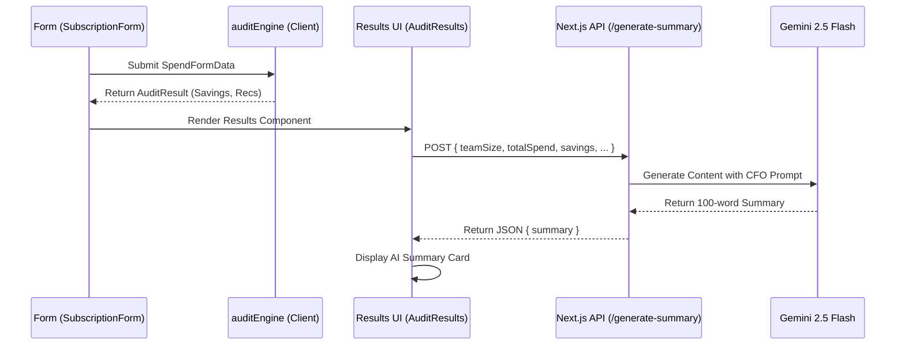
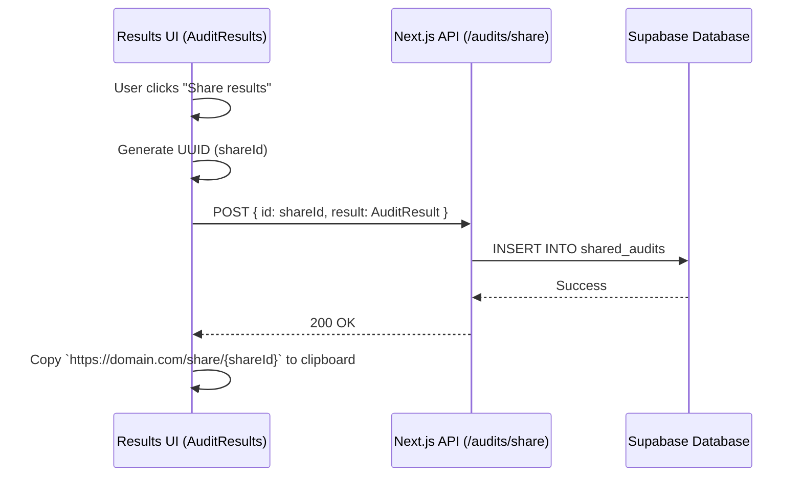

# Application Architecture

## Core Workflows

### 1. Audit Summary Generation Flow
This flow details how the user's form input is processed through the audit engine and summarized by the AI.

### 2. Share URL Generation Flow
This flow details how a shareable URL is created and saved to the database.

