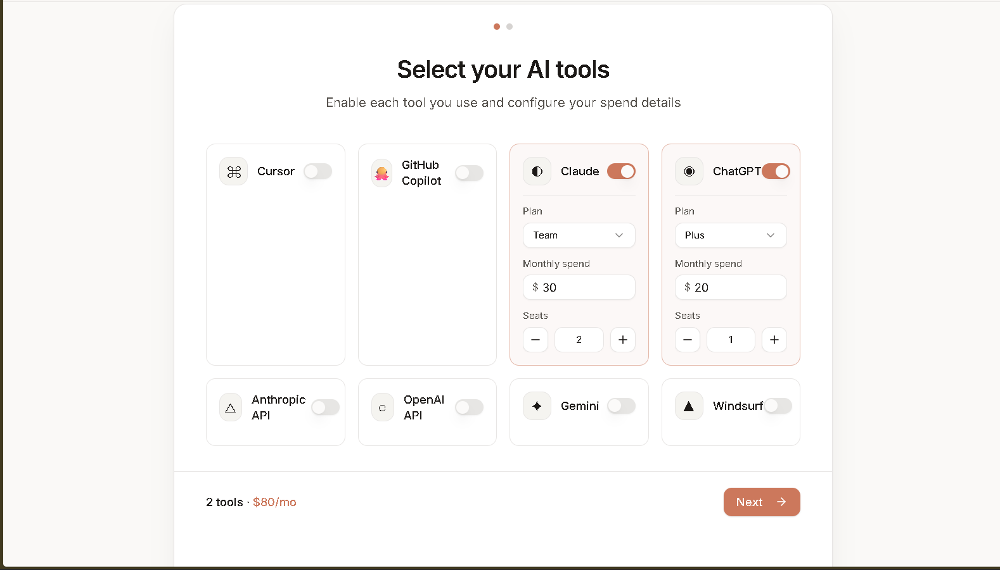
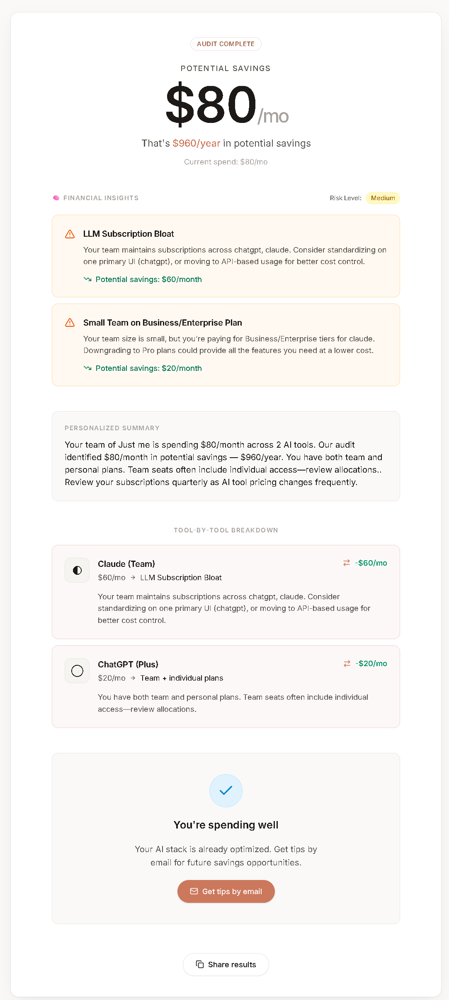
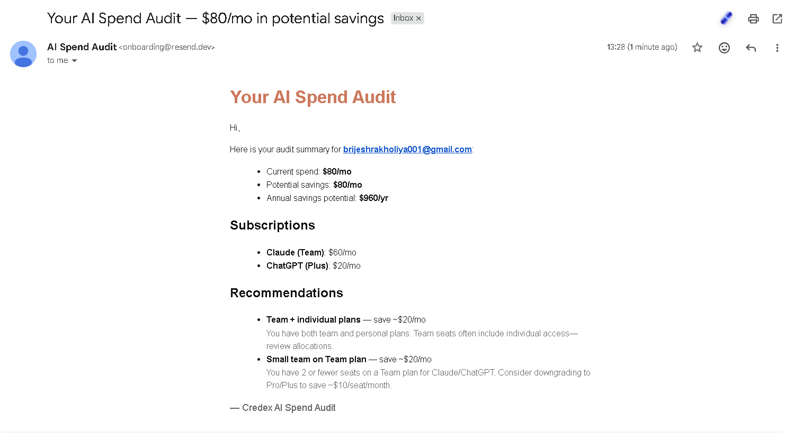

# AI Spend Audit

Free tool for startup founders and engineering managers to find where they're overpaying on AI tools. Enter your subscriptions, get an instant audit with savings recommendations.

## Screenshots




## Quick Start

```bash
npm install
cp .env.local.example .env.local
npm run dev
```

## Decisions

1. **Next.js App Router over Pages Router** — needed SSR for OG meta tags on share pages
2. **Supabase over MongoDB** — relational data + auto REST API
3. **Hardcoded audit rules over AI** — accuracy and predictability matter more than flexibility here
4. **Resend over SES** — simplest free tier setup
5. **Vitest over Jest** — faster, native TypeScript support

## Live URL

[https://credex-audit-chi.vercel.app/](https://credex-audit-chi.vercel.app/)

---

## Stack

- **Next.js 14** (App Router)
- **TypeScript**
- **Tailwind CSS**
- **shadcn/ui** (New York style)
- **Supabase** (client ready for auth/data)

## Project Structure

```
app/                 # App Router pages & layout
components/          # UI and feature components
  ui/                # shadcn/ui primitives
lib/
  auditEngine.ts     # Savings detection logic
  pricing.ts         # Tool catalog & pricing
  supabase/          # Browser & server Supabase clients
```

## Supabase Setup

Clients live in `lib/supabase/client.ts` (browser) and `lib/supabase/server.ts` (server). Share links use `shared_audits` — run `supabase/schema.sql` in the Supabase SQL editor before using **Share Results**.

```bash
# .env.local
NEXT_PUBLIC_SUPABASE_URL=
NEXT_PUBLIC_SUPABASE_ANON_KEY=
SUPABASE_SERVICE_ROLE_KEY=   # optional, recommended for API writes
RESEND_API_KEY=              # for audit report emails
RESEND_FROM_EMAIL=AI Spend Audit <onboarding@resend.dev>
```

Run the full `supabase/schema.sql` (includes `leads` table) before using email capture.

## Audit Engine

`lib/auditEngine.ts` analyzes subscriptions for:

- Overlapping chat AI tools
- Duplicate coding assistants
- Midjourney tier optimization
- Annual billing discounts
- Team vs individual plan overlap

Pricing data is maintained in `lib/pricing.ts`.
